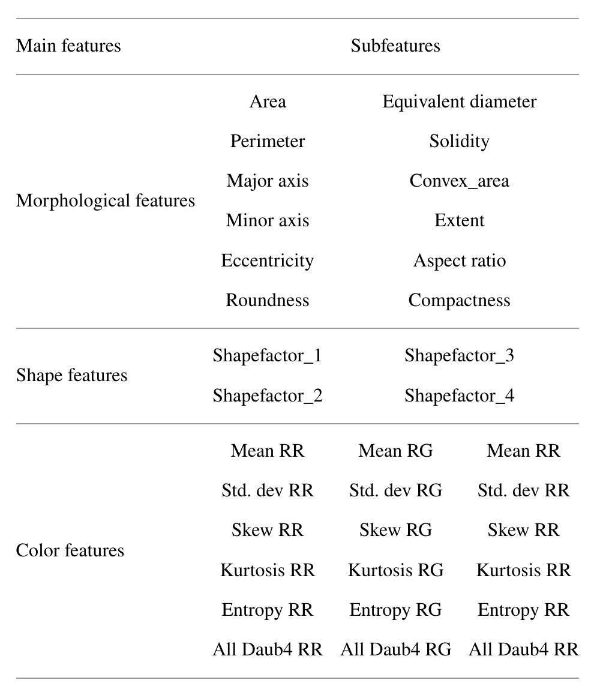

#  | Date Fruit Classification

A great number of fruits are grown around the world, each of which has various types. The factors that determine the type of fruit are the external appearance features such as color, length, diameter, and shape. The external appearance of the fruits is a major determinant of the fruit type. **Determining the variety of fruits by looking at their external appearance may necessitate expertise, which is time-consuming and requires great effort**. The aim of this study is to classify the types of date fruit, that are, Barhee, Deglet Nour, Sukkary, Rotab Mozafati, Ruthana, Safawi, and Sagai by using three different machine learning methods. [Here](https://www.hindawi.com/journals/mpe/2021/4793293/)

## Team members
| Team members     | Role                                                                      |
| ---------------- | ------------------------------------------------------------------------- |
| Razan Alyahya    | together   |
| Lolo Almuqbil    |  together |
| Mohammed Alrajeh      |  together |

## Dataset Overview:
This [dataset from Kaggle](https://www.kaggle.com/datasets/muratkokludataset/date-fruit-datasets) includes informatin about Dates in 7 Class; Barhee, Deglet Nour, Sukkary, Rotab Mozafati, Ruthana, Safawi, Sagai. The dataset has 35 columns and 898 rows.

## Dataset Description:
 

### Morphological Features:

Several of the morphological features are straightforward to understand, while some lesser known ones are as follows:

- EQDIASQ: the equivalent diameter, which is the diameter of a circle with the same area
- CONVEX_AREA: the area of the smallest convex polygon that contains the area
- SOLIDITY: the proportion of AREA within the convex polygon
- EXTENT: the proportion of AREA within the smallest bounding box that contains the area

Many of the morphological quantities can be calculated directly from other quantities as follows (ignoring unimportant constants)
- ASPECT_RATIO = MAJOR_AXIS / MINOR_AXIS
- COMPACTNESS = SQRT(AREA) / MAJOR_AXIS
- ECCENTRICITY = SQRT(1 - (MINOR_AXIS/MAJOR_AXIS)^2)
- EQDIASQ = SQRT(AREA)
- ROUNDNESS = AREA / PERIMETER^2
- SOLIDITY = AREA / CONVEX_AREA
- SHAPEFACTOR_1 = MAJOR_AXIS / AREA
- SHAPEFACTOR_2 = AREA / MAJOR_AXIS^3
- SHAPEFACTOR_3 = AREA / MAJOR_AXIS^2
- SHAPEFACTOR_4 = AREA / (MAJOR_AXIS * MINOR_AXIS)

So all the morphological quantities can be reproduced from just the following features:
- AREA
- PERIMETER
- MAJOR_AXIS
- MINOR_AXIS
- CONVEX_AREA
- EXTENT

## ML models comparison
| Model               | Accuracy                                                                                                                                                              |
| -------------------- | ------------------------------------------------------------------------------------------------------------------------------------------------------------------------ |
Logistic regression |	0.866667
KNN	|0.877778
Decision Tree	|0.816667
Random Forest|	0.883333

## The reason for choosing the ML Models:
- The main reason we have chosen Logistic regression is that we have found a [reseasher paper](https://www.hindawi.com/journals/mpe/2021/4793293/) that have used the same dataset and one of the models that they have used were Logistic Regression.
- KNN is a popular machine learning model and simple to learn as we have no prior experience with ML before the bootcamp, and from what we have read it performs well with small datasets.
- Decision trees are excellent tools for helping us to choose between several feature and decisce at the end which type is it (the date).
- Random Forest gives us the final predictions are either the majority predictions or the average of all the predictions made by decision trees.
